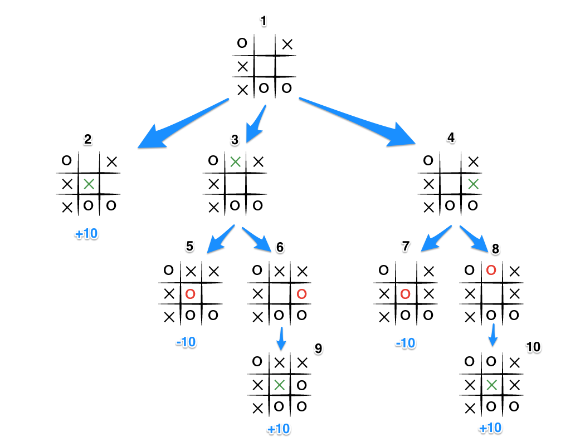

**A simple Tic-Tac-Toe bot**

The aim of this repo is to develop a simple bot that plays Tic-Tac-Toe using the **minimax algorithm** from the classic [adversarial search literature](https://en.wikibooks.org/wiki/Artificial_Intelligence/Search/Adversarial_search/Minimax_Search).

**Environment**:

The classic Tic-Tac-Toe is a game for two players, X and O, who take turns marking the spaces in a 3×3 grid.
The player who succeeds in placing three of their marks in a horizontal, vertical, or diagonal row wins the game.

```
+-----+
|X| | |   "O" represents a move done by the bot
| |O| |   "X" represents a move dony by the human player
| | |X|
+-----+
```

**State space and action space**:

The state space is finite and has 3^9 = 19683 possible values, as there are a total of 9 cells, each of them with 3 possible values: 
- unmarked
- marked with X
- marked with O

The actions space, which will be the branching factor of minimax algorithm, has a maximum value of 9 corresponding to the empty board, and decreases of one each time an agent (either the human player or the bot) takes an action.

**Algorithm**:

Minimax is a recursive algorithm that can be used to make decisions in zero-sum games, 
where one player’s loss is the other player’s gain.
For a terminal state, i.e. a state where the game is finished, the minimax value for the bot is +10 if it has won, -10 if it has lost or 0 if it's a tie.
[...]
For non terminal state, the minimax value is the max of minimax value if bot is playing of min of minimax value if human player is playing

<p align="center">
  
</p>
